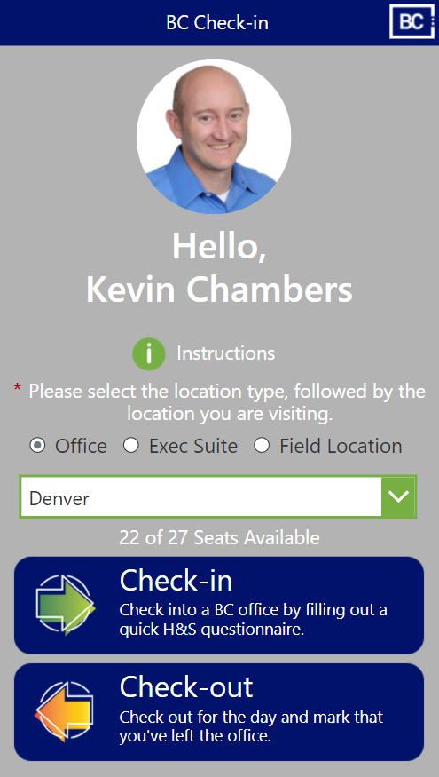
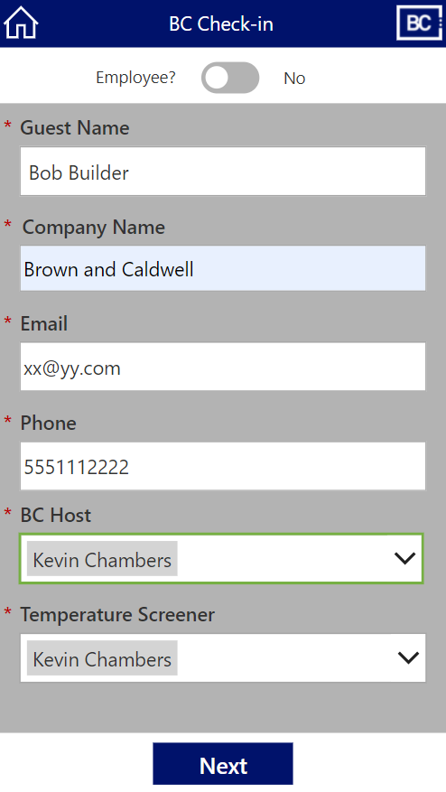
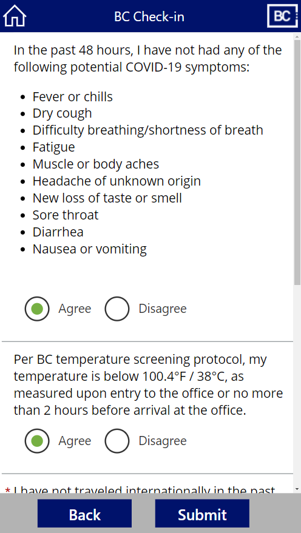
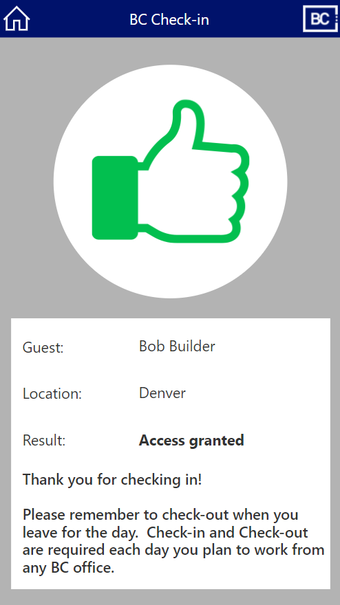

# Brown and Caldwell Office Check-in App

## Summary

This is a phone-based Canvas Power App which provides functionality to capture a health atastation and digital badge for physical security.  There is a companior admin app to configure office capacity and COVID phase information.  This application also has workflows to alert office leads about capacity thresholds and Health & Safety about failed check-ins.  Reporting is also provided for contact tracing.

## Applies to

* [Microsoft Power Apps](https://docs.microsoft.com/powerapps/)

## Compatibility

## Authors

Solution|Author(s)
--------|---------
Office Check-In | [Brown and Caldwell](https://BrownandCaldwell.com), Kevin Chambers, Jason Vale

## Features

This app illustrates the following concepts:

* Design patterns, including using the HTML control for additional styling capability
* Utilizing components (title bars, navigation, preloader)
* Multi-screen form process

## Prerequisites

The SharePoint datasource must be configured

## Data Sources

This template uses SharePoint as it's main data source. To avoid premium licensing for all users, each night a backup is snapshoted to Dataverse tables that feed a Power Bi report, the SharePoint tables are re-initialized.

## For more information

- [How to engage Brown and Caldwell for a similar app](https://www.brownandcaldwell.com)
- [Overview of creating apps in Power Apps](https://docs.microsoft.com/powerapps/maker/)
- [Power Apps canvas apps documentation](https://docs.microsoft.com/en-us/powerapps/maker/canvas-apps/)

